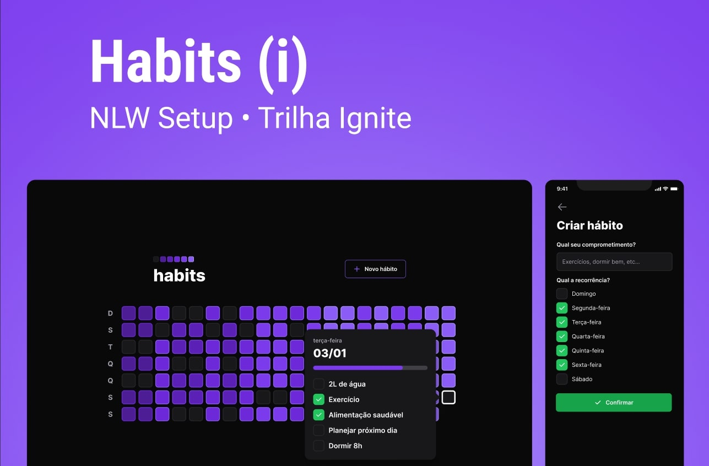

<h1 align="center"> Habits </h1>

NLW is an exclusive and free event, promoted by Rocketseat for teaching WEB technologies.  

  <a href="#-technologies">Technologies</a>&nbsp;&nbsp;&nbsp;|&nbsp;&nbsp;&nbsp;
  <a href="#-project">Project</a>&nbsp;&nbsp;&nbsp;|&nbsp;&nbsp;&nbsp;
  <a href="#-layout">Layout</a>&nbsp;&nbsp;&nbsp;|&nbsp;&nbsp;&nbsp;
  <a href="#memo-license">License</a>

  

 

  

## 🚀 Technologies

This project was developed with the following technologies:

- Frontend: Vite with React, Tailwind to CSS and Typescript
- Backend: Fastify with Node.js, Prisma to ORM and Typescript
- Mobile: React Native, Tailwind to CSS and Typescript
- Git e Github
- Figma

## 💻 Project

Habits is an app to help track habits.

<!-- - [Visite o projeto online](https://wagnerGCastro.github.io/nlw-setup) -->

## 🔖 Layout

You can preview the project layout through [FROM THIS LINK](https://www.figma.com/community/file/1195326661124171197). It is necessary to have an account on [Figma](https://figma.com) to access it.

## :memo: License

This project is licensed under the MIT license.

---

Made with ♥ by Rocketseat :wave: [Join our community!](https://discord.gg/rocketseat)
